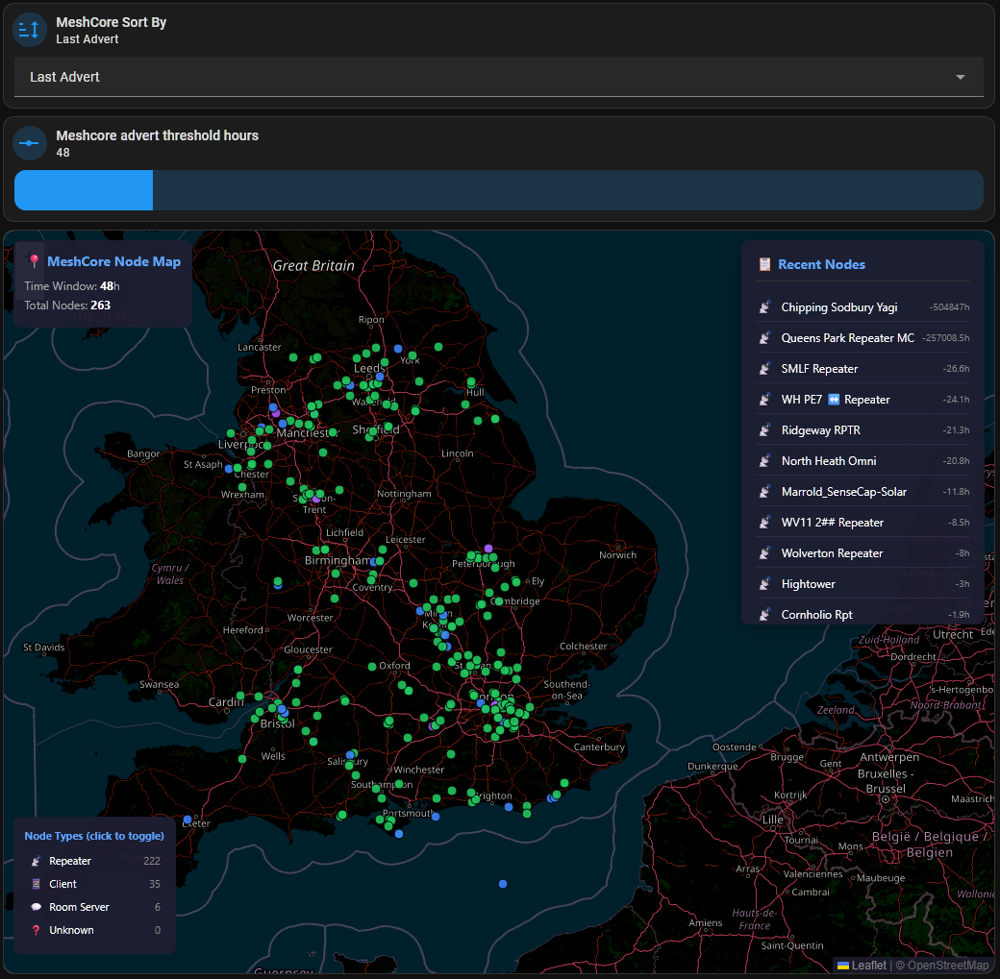

# MeshCore Home Assistant Panel v2

A comprehensive Home Assistant dashboard for [MeshCore](https://meshcore.co.uk/) mesh networking, featuring interactive maps, heatmaps, signal tracking, playback recording, and automated contact management.


## Features

### 📍 Interactive Maps

* **Node Map** - Shows all nodes by type (Repeater 📡, Client 📱, Room Server 💬)
* **Hop Frequency Heatmap** - Visualizes which repeaters handle the most traffic
* **Direct Links Heatmap** - Shows 1-hop direct connections between nodes

### ⏪ Playback Recording

* **24-hour history** - Snapshots recorded every 5 minutes
* **Timeline scrubbing** - Drag slider to view past network state
* **Playback controls** - Play, pause, and go live
* **Threshold filter slider** - Filter playback by time window (1h-48h or ALL)


### 📊 Signal Tracking

* SNR/RSSI monitoring per contact
* Hop count tracking with path visualization
* Multiple reception paths displayed
* Message history with timestamps

### 🤖 Automation

* **Auto-greeting** - Welcomes new companions on Public channel (configurable)
* **Auto-cleanup** - Removes old contacts (30+ days) from HA and device
* **Persistence** - Survives HA reboots (hops data, last messages, greeted list)

### 🗺️ Path Visualization

* Click node names to highlight message paths
* Dashed lines show routing through mesh
* Color-coded by hop count or traffic intensity

## Requirements

* Home Assistant 2024.1+
* [MeshCore Integration](https://github.com/meshcore-dev/meshcore-ha) v2.3.0+
* [AppDaemon](https://appdaemon.readthedocs.io/) 4.4+
* HACS (for optional cards)

### Optional HACS Cards

* `mushroom-cards` - For styled controls
* `auto-entities` - For dynamic entity lists
* `config-template-card` - For template-based cards

## Installation

### 1. Install AppDaemon Add-on

1. Go to **Settings → Add-ons → Add-on Store**
2. Search for **AppDaemon** and install it
3. Start the add-on

### 2. Install AppDaemon Scripts

Download all `.py` files from this repo's `appdaemon/apps/` folder and copy them to your AppDaemon apps folder.

**For Home Assistant OS (Add-on):**

```
/addon_configs/a0d7b954_appdaemon/apps/
```

**For Home Assistant Container/Core:**

```
/config/appdaemon/apps/
```

Files to copy:

```
meshcore_hops.py              # Signal & hop tracking
meshcore_paths.py             # Path visualization & hop markers
meshcore_cleanup.py           # Auto-cleanup old contacts
meshcore_greeter.py           # Auto-greet new contacts
meshcore_heatmap_export.py    # Heatmap data export
meshcore_nodemap_export.py    # Node map data export
meshcore_directlinks_export.py # Direct links data export
meshcore_snapshot_recorder.py  # Playback recording
```

You can copy files using:

* **File Editor add-on** - navigate to the folder and upload
* **Samba share** - if enabled
* **SSH/Terminal** - command line access

### 3. Configure AppDaemon

Edit `appdaemon.yaml` in the AppDaemon config folder:

**For Home Assistant OS:** `/addon_configs/a0d7b954_appdaemon/appdaemon.yaml`

#### Option A: Default (via Supervisor proxy) — simple but limited

The default AppDaemon add-on configuration connects via the HA Supervisor proxy. This is the easiest setup but has a **4MB WebSocket message size limit** that can cause crashes on larger installations.

```yaml
---
appdaemon:
  latitude: 51.5
  longitude: -0.1
  elevation: 10
  time_zone: Europe/London
  plugins:
    HASS:
      type: hass
http:
  url: http://0.0.0.0:5050
admin:
api:
hadashboard:
```

#### Option B: Direct connection (recommended for larger installations)

If you have many entities or see WebSocket message size errors, connect AppDaemon directly to Home Assistant using a long-lived token. This bypasses the Supervisor proxy and its 4MB limit.

```yaml
---
appdaemon:
  latitude: 51.5
  longitude: -0.1
  elevation: 10
  time_zone: Europe/London
  plugins:
    HASS:
      type: hass
      ha_url: http://192.168.0.250:8123
      token: YOUR_LONG_LIVED_TOKEN_HERE
http:
  url: http://0.0.0.0:5050
admin:
api:
hadashboard:
```

**To create a long-lived token:**

1. Go to your HA profile page (click your name in the bottom-left)
2. Scroll to **Long-Lived Access Tokens** at the bottom
3. Click **Create Token**, give it a name (e.g. "AppDaemon")
4. Copy the token and paste it into `appdaemon.yaml`

> ⚠️ **Security note:** If you have `ip_ban_enabled: true` in `configuration.yaml`, direct connections using a long-lived token may trigger IP bans after failed login attempts during testing. You can temporarily disable banning while setting up: set `ip_ban_enabled: false`, configure the direct connection, then re-enable it once AppDaemon is connecting successfully.

> ℹ️ **Note:** The `secrets:` reference in `appdaemon.yaml` only works when connecting via the Supervisor proxy. When using direct connection with `ha_url`, you must embed the token directly in `appdaemon.yaml` — `!secret` references are not resolved.

### 4. Configure Apps

Edit `apps.yaml` in the same folder as the Python files:

**For Home Assistant OS:** `/addon_configs/a0d7b954_appdaemon/apps/apps.yaml`

```yaml
meshcore_hops:
  module: meshcore_hops
  class: MeshCoreHops

meshcore_paths:
  module: meshcore_paths
  class: MeshCorePathMap
  my_pubkey: "YOUR_PUBKEY_HERE"

meshcore_cleanup:
  module: meshcore_cleanup
  class: MeshCoreCleanup

meshcore_greeter:
  module: meshcore_greeter
  class: MeshCoreGreeter
  my_name: "Your Repeater Name"
  hops_distant: 5

meshcore_heatmap_export:
  module: meshcore_heatmap_export
  class: MeshCoreHeatmapExport

meshcore_nodemap_export:
  module: meshcore_nodemap_export
  class: MeshCoreNodeMapExport

meshcore_directlinks_export:
  module: meshcore_directlinks_export
  class: MeshCoreDirectLinksExport

meshcore_snapshot_recorder:
  module: meshcore_snapshot_recorder
  class: MeshCoreSnapshotRecorder
```

### 5. Install HTML Map Pages

Copy files from this repo's `www/` folder to your Home Assistant www folder:

**Important:** Always use `/config/www/` (not the AppDaemon folder!)

```
/config/www/meshcore_heatmap_playback.html
/config/www/meshcore_nodemap.html
/config/www/meshcore_directlinks_playback.html
```

### 6. Create Input Helpers

Go to **Settings → Devices & Services → Helpers → Create Helper**

#### Number Helpers

Create 3 number helpers with these settings:

| Name | Entity ID | Min | Max | Step | Initial |
| --- | --- | --- | --- | --- | --- |
| `meshcore_advert_threshold_hours` | `input_number.meshcore_advert_threshold_hours` | 1 | 720 | 1 | 12 |
| `meshcore_messages_threshold_hours` | `input_number.meshcore_messages_threshold_hours` | 1 | 720 | 1 | 24 |
| `meshcore_heatmap_threshold_hours` | `input_number.meshcore_heatmap_threshold_hours` | 1 | 720 | 1 | 168 |

#### Dropdown Helper

Create 1 dropdown helper:

| Name | Entity ID | Options |
| --- | --- | --- |
| `meshcore_sort_by` | `input_select.meshcore_sort_by` | `Last Advert`, `Last Message`, `Direct Links` |

### 7. Configure Your Pubkey

Set your MeshCore device's pubkey in `apps.yaml`:

```yaml
meshcore_paths:
  module: meshcore_paths
  class: MeshCorePathMap
  my_pubkey: "Your pubkey"
```

**To find your pubkey:**

1. Go to **Developer Tools → States**
2. Search for `binary_sensor.meshcore_`
3. Find your device's contact sensor
4. Copy the `pubkey_prefix` attribute (first 12 characters)

This works for both Repeaters and Companion clients.

### 8. Restart AppDaemon

Go to **Settings → Add-ons → AppDaemon → Restart**

Check the logs for any errors: **Settings → Add-ons → AppDaemon → Log**

### 9. Add Dashboard Cards

Test with a simple iframe card first:

```yaml
type: iframe
url: /local/meshcore_heatmap_playback.html
aspect_ratio: "4:3"
```

If you see a map, the HTML files are working!

See `dashboards/` folder for full dashboard examples.

## Configuration

### meshcore_greeter.py

Configure via `apps.yaml`:

```yaml
meshcore_greeter:
  module: meshcore_greeter
  class: MeshCoreGreeter
  my_name: "Your Repeater Name"   # Name shown in greeting messages
  hops_distant: 5                  # Max hops to greet (nodes further away ignored)
```

**Note:** `my_name` is just a display name for greetings, not the pubkey.

#### Test Greeting

To test the greeter is working:

1. Go to **Developer Tools → Events**
2. Fire event: `meshcore_greeter_test`
3. You should see the test message in the public channel

### meshcore_cleanup.py

Default is 30 days. Edit line 25:

```python
threshold_days = 30
```

### meshcore_snapshot_recorder.py

Default settings:
- **24 hours** of rolling history
- **288 snapshots** maximum (5-minute intervals)
- Snapshots only saved when data changes

## Playback Feature

The heatmap and direct links maps include playback controls:

### Controls

| Button | Function |
| --- | --- |
| ▶️ | Play through history |
| 🔴 LIVE | Return to live data |
| Timeline slider | Scrub through 24h history |
| Filter slider | Filter by time window (1h-48h or ALL) |

### How it works

1. `meshcore_snapshot_recorder.py` takes snapshots every 5 minutes
2. Snapshots are saved to `/config/www/meshcore_*_history.json`
3. Old snapshots (>24h) are automatically cleaned up
4. Playback HTML loads history and allows timeline scrubbing

## Data Persistence

The following data survives HA reboots:

| File | Data |
| --- | --- |
| `/config/www/meshcore_hops_sensors.json` | Full hops sensor data |
| `/config/www/meshcore_last_messages.json` | Last message times |
| `/config/www/meshcore_hops_data.json` | Hop node use counts |
| `/config/www/meshcore_greeted.json` | Greeted contacts list |
| `/config/www/meshcore_directlinks_persist.json` | Direct link connections |
| `/config/www/meshcore_heatmap_history.json` | Heatmap playback history (24h) |
| `/config/www/meshcore_directlinks_history.json` | Direct links playback history (24h) |

Data older than 7 days is automatically cleaned up (except playback history which is 24h).

## Entities Created

### Sensors

* `sensor.meshcore_hops_<pubkey>` - Per-contact hop/signal data
* `sensor.meshcore_map_entities` - List of map entities
* `sensor.meshcore_path_entities` - List of path entities
* `sensor.meshcore_hop_entities` - List of hop node entities

### Device Trackers

* `device_tracker.meshcore_path_<n>` - Message path trackers
* `device_tracker.meshcore_hop_<n>` - Hop node markers

## Screenshots

### Hop Frequency Heatmap (with Playback)


### Node Type Map



### Direct Links Map (with Playback)


## Troubleshooting

### AppDaemon keeps stopping (WebSocket message size error)

If you see this error in AppDaemon logs:

```
ERROR HASS: Error from aiohttp websocket: Message size XXXXXXX exceeds limit 4194304
```

The Supervisor proxy has a hard 4MB WebSocket message limit. On larger installations with many entities, HA state updates can exceed this. Fix it by switching to a direct connection — see **Option B** in the AppDaemon configuration section above.

Alternatively, if you prefer to stay on the proxy connection, add the following to `configuration.yaml`:

```yaml
websocket_api:
  max_message_size: 8388608
```

Then restart Home Assistant.

### AppDaemon callback queues growing continuously

If you see large and growing thread queue warnings in the AppDaemon logs like:

```
WARNING thread-3 queue size: 2000+ (meshcore_paths processing)
```

This is caused by `listen_state` listeners registered against broad entity domains (e.g. `"sensor"` or `"binary_sensor"`). These fire on every state change in HA, including changes made by the apps themselves, creating a feedback cascade.

All apps in this repo have been updated to use `listen_event("meshcore_raw_event")` directly instead of watching sensor state. If you are running older versions of the scripts, update to the latest versions.

You can monitor callback counts in the AppDaemon admin UI at `http://YOUR_HA_IP:5050` under the **Apps** tab.

### Maps not showing data

1. Check AppDaemon logs for errors: **Settings → Add-ons → AppDaemon → Log**
2. Verify JSON files exist in `/config/www/`
3. Clear browser cache or hard refresh (Ctrl+Shift+R)
4. Check browser console for JavaScript errors (F12)

### HTML files not found

* Make sure files are in `/config/www/` (not `/addon_configs/.../www/`)
* Restart Home Assistant after adding files
* Try accessing directly: `http://YOUR_HA_IP:8123/local/meshcore_heatmap_playback.html`

### Input helpers not working

* Check the Entity ID matches exactly (case sensitive)
* Entity ID should be `input_number.meshcore_advert_threshold_hours` not `input_number.input_number.meshcore_...`

### Paths not appearing

1. Check that `meshcore_raw_event` events with `event_type: EventType.RX_LOG_DATA` are firing in **Developer Tools → Events**
2. Confirm the decrypted section contains `text` and `decrypted: true` — undecrypted packets are skipped
3. Check that contacts have coordinates (lat/lon) in their binary sensor attributes
4. Verify path has at least 2 nodes — direct (1-hop) messages don't produce a path line

### Cleanup not working

1. Check AppDaemon logs at 3am
2. Verify MeshCore services are available
3. Check `last_advert` and `last_message` attributes

### Greeter not sending messages

1. Check service name: `meshcore.send_channel_message`
2. Test manually in **Developer Tools → Services**
3. Fire test event: `meshcore_greeter_test` in **Developer Tools → Events**

### Playback not showing data

1. Wait for snapshots to accumulate (5 min intervals)
2. Check `/config/www/meshcore_heatmap_history.json` exists
3. Verify `meshcore_snapshot_recorder` in AppDaemon logs

## Credits

* [MeshCore](https://meshcore.co.uk/) - Mesh networking protocol
* [MeshCore HA Integration](https://github.com/meshcore-dev/meshcore-ha) - Home Assistant integration
* [Leaflet](https://leafletjs.com/) - Interactive maps
* [Leaflet.heat](https://github.com/Leaflet/Leaflet.heat) - Heatmap plugin

## License

MIT License - See [LICENSE](LICENSE) file

## Contributing

Contributions welcome! Please open an issue or pull request.
